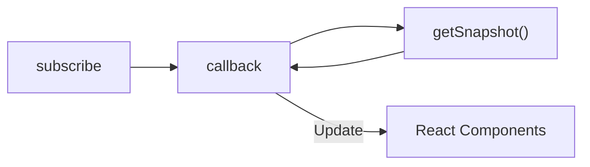
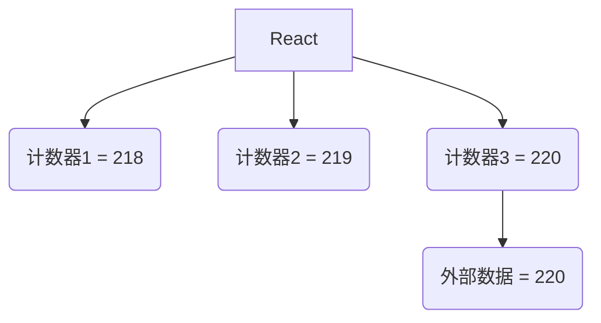

一般来说，React 的状态都来源于自身，比如通过 `useState` 创建的状态。

但是有时候，我们的状态也有来源于别人家，来看 React 官网的[经典例子](https://react.dev/reference/react/useSyncExternalStore)：

监听网络是否在线，如果在线，就显示 ✅ Online，否则显示 ❌ Disconnected：


*使用 Chrome DevTools > Network 模拟在线、离线状态*

这里的**在线状态**就来自于外部的 `navigator.onLine`，用 `useSyncExternalStore` 再合适不过：

```typescript
import { useSyncExternalStore } from 'react';

export default function ChatIndicator() {
  const isOnline = useSyncExternalStore(subscribe, getSnapshot);
  return <h1>{isOnline ? '✅ Online' : '❌ Disconnected'}</h1>;
}

function getSnapshot() {
  return navigator.onLine;
}

function subscribe(callback) {
  window.addEventListener('online', callback);
  window.addEventListener('offline', callback);
  return () => {
    window.removeEventListener('online', callback);
    window.removeEventListener('offline', callback);
  };
}
```

可以看到，享用 `useSyncExternalStore` 的基础配置，一个是订阅函数 `subscribe`，另一个是获取快照函数 `getSnapshot`：

```typescript
  const isOnline = useSyncExternalStore(subscribe, getSnapshot);
```

仔细看订阅函数 `subscribe`：在函数内部执行逻辑，调用 `callback`，最后返回一个取消订阅的函数。是不是跟平常用的副作用钩子 `useEffect` 很类似：

```typescript
function subscribe(callback) {
  window.addEventListener('online', callback);
  window.addEventListener('offline', callback);
  return () => {
    window.removeEventListener('online', callback);
    window.removeEventListener('offline', callback);
  };
}
```

这个 `callback` 需要注意，它是 React 叫的快递小哥，会去调用 `getSnapshot`，如果拿到新的值，就马上通知商家，重新渲染组件。



在上这个例子中，似乎用 `useEffect` 也能够完成同样的事情：

```typescript
import { useState, useEffect } from 'react';

export default function ChatIndicator() {
  const [isOnline, setIsOnline] = useState(navigator.onLine);

  useEffect(() => {
    const handleOnline = () => setIsOnline(true);
    const handleOffline = () => setIsOnline(false);

    window.addEventListener('online', handleOnline);
    window.addEventListener('offline', handleOffline);

    return () => {
      window.removeEventListener('online', handleOnline);
      window.removeEventListener('offline', handleOffline);
    };
  }, []);

  return <h1>{isOnline ? '✅ Online' : '❌ Disconnected'}</h1>;
}
```

既然 `useEffect` 可以实现同样的效果，那使用 `useSyncExternalStore` 是不是脱裤子放屁，多此一举呢？

这就不得不说起 React 的撕裂了，来看一下简单的小组件：


仔细看，在打开的瞬间，这些计数器 Counter 对应的数字都不一样，有 218、219、220，随后统一变成 221、222。

实际上，这些计数器背后**都引用同一个外部数据源**。按道理，这些计数器的值应该始终保持一致。

但是 React 18 新引入的并发渲染机制就是不讲道理。



由于并发，造成了部分组件同步了最新的外部数据，但有些组件落后还没来得及更新。

落后就要挨打，这就是造成了在视觉上，组件被撕\~裂\~了\~。

这就是 `useSyncExternalStore` 存在的必要性，它就是要


