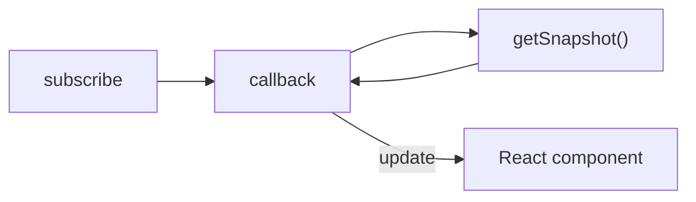
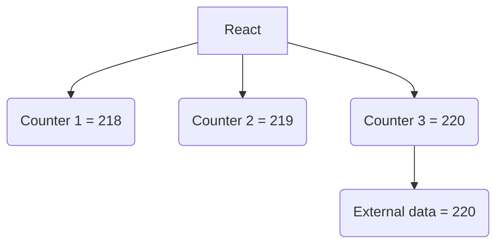
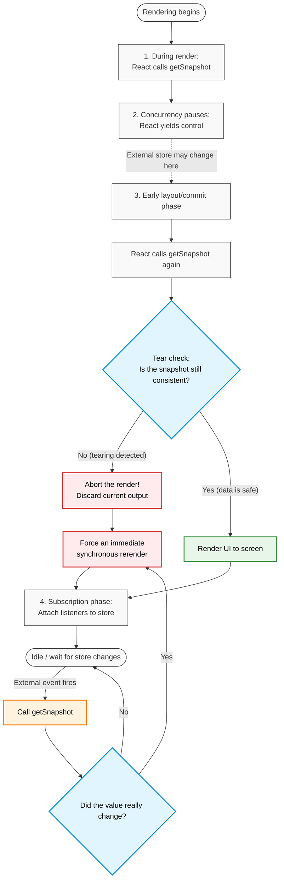

In general, React state comes from inside the component itself, such as values created with `useState`.

But sometimes, the state comes from somewhere else. As shown in the classic example from the React docs, we may need to track whether the browser is online:

If the network is available, show ✅ Online; otherwise show ❌ Disconnected.


*Use Chrome DevTools > Network to simulate online/offline states.*

Here, the **online status** comes from the external value `navigator.onLine`, so `useSyncExternalStore` is a perfect fit:

```typescript
import { useSyncExternalStore } from 'react';

export default function ChatIndicator() {
  const isOnline = useSyncExternalStore(subscribe, getSnapshot);
  return <h1>{isOnline ? '✅ Online' : '❌ Disconnected'}</h1>;
}

function getSnapshot() {
  return navigator.onLine;
}

function subscribe(callback) {
  window.addEventListener('online', callback);
  window.addEventListener('offline', callback);
  return () => {
    window.removeEventListener('online', callback);
    window.removeEventListener('offline', callback);
  };
}
```

As you can see, the basic setup for `useSyncExternalStore` includes a subscribe function and a getSnapshot function:

```typescript
const isOnline = useSyncExternalStore(subscribe, getSnapshot);
```

If you look closely at the subscribe function, it runs logic inside the function, calls `callback`, and finally returns a cleanup function. This feels very similar to the usual effect hook `useEffect`:

```typescript
function subscribe(callback) {
  window.addEventListener('online', callback);
  window.addEventListener('offline', callback);
  return () => {
    window.removeEventListener('online', callback);
    window.removeEventListener('offline', callback);
  };
}
```

That `callback` is important: React calls it like a delivery person, and it asks `getSnapshot` for the latest value. If the value has changed, React immediately updates the component.



At this point, you might think that `useEffect` could also do the same thing:

```typescript
import { useState, useEffect } from 'react';

export default function ChatIndicator() {
  const [isOnline, setIsOnline] = useState(navigator.onLine);

  useEffect(() => {
    const handleOnline = () => setIsOnline(true);
    const handleOffline = () => setIsOnline(false);

    window.addEventListener('online', handleOnline);
    window.addEventListener('offline', handleOffline);

    return () => {
      window.removeEventListener('online', handleOnline);
      window.removeEventListener('offline', handleOffline);
    };
  }, []);

  return <h1>{isOnline ? '✅ Online' : '❌ Disconnected'}</h1>;
}
```

If `useEffect` can do the same thing, is `useSyncExternalStore` just unnecessary extra work?

This is where React tearing becomes important. Consider a simple component like this:


If you look carefully, when the page first opens, these counters show different values such as 218, 219, and 220, and then they all eventually become 221.

In reality, all of these counters are reading from the same external data source. In theory, they should always stay in sync.

But React 18’s concurrent rendering model doesn’t always behave politely.



Because rendering happens concurrently, some components may update to the latest external value while others lag behind.

That lag creates the visual effect of components being “torn” apart.

This is exactly why `useSyncExternalStore` exists. It calls `getSnapshot` during rendering to check whether the value is still current. If not, React discards the current render and performs a **synchronous, non-blocking** rerender with the latest value:


